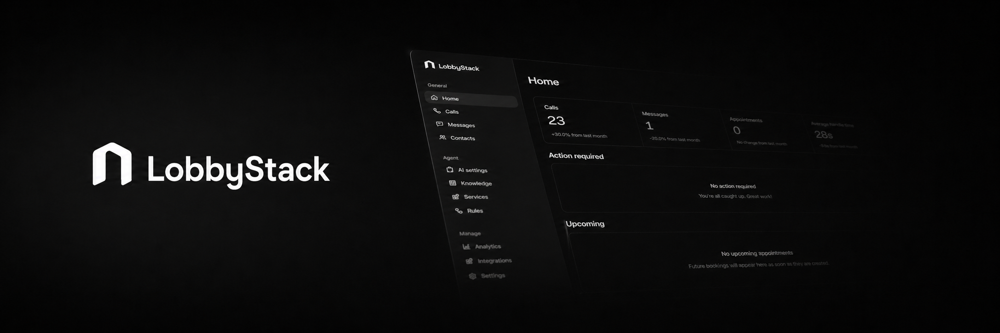

<p align="center">
  
</p>

<div align="center">

# LobbyStack

### The open-source AI receptionist for calls, texts, and appointments. An alternative to Myaifrontdesk, Upfirst, Goodcall, Phonely, etc.

LobbyStack is an open-source AI receptionist platform for small businesses. It answers phone calls, responds to SMS messages, books appointments, handles reschedules and cancellations, and transfers conversations to a human when needed.

It is built for clinics, salons, repair shops, local service companies, restaurants, and any business that loses revenue when nobody is available to answer the phone.

LobbyStack gives teams a modern AI front desk that can be hosted in the cloud or self-hosted on their own infrastructure.

[Website](https://lobbystack.com) &middot;
[Try the app](https://app.lobbystack.com/signup) &middot;
[Docs](https://docs.lobbystack.com) &middot;
[Self-hosting](https://docs.lobbystack.com/self-hosting/overview) &middot;
[GitHub](https://github.com/morencyr/LobbyStack)

[](./LICENSE)
[](https://github.com/morencyr/LobbyStack)
[](https://www.typescriptlang.org/)
[](https://convex.dev)
[](https://docs.lobbystack.com/self-hosting/overview)

</div>

---

## Why LobbyStack?

Most AI receptionist tools are closed, expensive, and difficult to adapt to real business workflows. LobbyStack is different.

- **Open source by default.** Inspect the code, self-host it, extend it, and keep control of your data.
- **Built for real phone calls.** Handle natural voice conversations, interruptions, transfers, and follow-ups.
- **Calls and SMS in one place.** Manage phone conversations and text messages from the same inbox.
- **Scheduling built in.** Book, reschedule, and cancel appointments through Google Calendar or Outlook.
- **Designed for SMBs.** Simple setup, transparent pricing, and no enterprise-only feature gatekeeping.
- **Human fallback.** Transfer calls or escalate messages when the AI should not handle something alone.

## Core Features

### ☎️ AI phone receptionist

LobbyStack answers inbound calls with a natural voice agent trained on your business information. It can answer common questions, collect caller details, take messages, qualify requests, offer appointment slots, and transfer to a human when required.

### 💬 AI SMS assistant

Customers can text the business number and receive helpful replies automatically. LobbyStack can answer questions, continue conversations after calls, and handle replies to booking confirmations.

### 📅 Appointment scheduling

LobbyStack connects to calendars, checks availability, offers time slots, books appointments, and sends confirmations. Customers can also reply later to reschedule or cancel without calling back.

### 📚 Knowledge base

Upload business information, FAQs, services, pricing, policies, and internal notes. The AI uses this knowledge to answer accurately and consistently.

### 🧑‍💼 Human handoff

Some conversations should go to a person. LobbyStack can transfer a live call, take a message, or notify the team by SMS, email, Slack, or another configured channel.

### 📥 Shared inbox

Review calls, SMS threads, transcripts, recordings, appointments, and customer details from one dashboard.

### 🔌 Integrations

LobbyStack is designed to connect with the tools small businesses already use:

- Google Calendar and Microsoft Outlook for appointment availability

## Use cases

LobbyStack can be adapted for many local business workflows:

- Clinics and healthcare offices
- Salons, spas, and barbershops
- Auto repair shops
- Home service companies
- Restaurants
- Dental offices
- Law firms and professional services
- Property managers
- Any business that receives appointment, pricing, hours, or availability questions by phone or SMS

## Product Areas

| Area | What it gives you |
| --- | --- |
| Voice reception | Inbound AI calls through Twilio Voice, Twilio Media Streams, and OpenAI Realtime. |
| Business knowledge | Answers from structured business facts, text entries, documents, and imported website pages. |
| Booking | Service-aware scheduling with availability checks and calendar handoff. |
| Appointment changes | Safer cancellation and rescheduling flows with appointment lookup and verification. |
| Human handoff | Live transfer and follow-up tasks for calls that need staff attention. |
| SMS | Text conversations and booking outcomes connected to the same customer history. |
| Dashboard | Calls, messages, contacts, appointments, recordings, transcripts, follow-ups, and analytics together. |
| Usage and billing | Hosted plans, voice usage, alert SMS, outbound call attempts, storage, and metered add-ons. |

## Built With

| Layer | Main components |
| --- | --- |
| App | React, Vite, Tailwind CSS, shadcn/ui |
| Backend | Convex |
| Voice gateway | Fastify, Twilio, OpenAI Realtime |

## Hosted And Open Source

LobbyStack is open source with a hosted cloud service.

Use **LobbyStack Cloud** when you want the product managed for you. You still control the receptionist behavior, knowledge, services, rules, numbers, integrations, and team workflow from the app.

Self-host when your team wants to run the stack on your own infrastructure with your own Convex, Twilio, OpenAI, calendar, analytics, billing, and email provider accounts.

Full product control in the hosted app. Infrastructure ownership when you self-host. Same open-source core either way.

## Built For Developers Too

LobbyStack is a TypeScript monorepo with Convex as the source of truth and a narrow voice gateway for the live call path.

```text
apps/
  web/             React + Vite dashboard for staff
  voice-gateway/   Twilio Voice, Media Streams, and OpenAI Realtime bridge
convex/            backend, auth, business state, booking, knowledge, workflows
packages/          shared domain, providers, telemetry, config, and test helpers
mintlify/          public documentation source
docs/              architecture notes, ADRs, provider docs, and validation notes
```

Read the [self-hosting overview](https://docs.lobbystack.com/self-hosting/overview) for the provider map and deployment expectations, or use the [Docker Compose guide](https://docs.lobbystack.com/self-hosting/docker-compose) for the official single-host baseline.

## Getting Started

### Hosted App

1. [Create a LobbyStack account](https://app.lobbystack.com/signup).
2. Verify your mobile number.
3. Import website knowledge, or skip and add knowledge manually later.
4. Claim a business number.
5. Configure AI settings, services, knowledge, and rules before sending live calls.

The full hosted walkthrough lives in the [quick start guide](https://docs.lobbystack.com/quickstart).

### Local Development

```bash
cp .env.example .env
pnpm install
pnpm convex dev
pnpm dev
pnpm seed:demo
```

Mock providers are part of the default development path, so contributors can exercise flows without live Twilio, OpenAI, calendar, or email credentials. Provider setup notes live in the [docs](https://docs.lobbystack.com/self-hosting/providers).

### Self-Hosted Docker Compose

```bash
git clone https://github.com/lobbystack/lobbystack.git
cd lobbystack
pnpm install
cp .env.self-hosted.example .env.self-hosted
pnpm self-hosted:secrets -- --write .env.self-hosted
# Edit .env.self-hosted for localhost smoke first; see the docs guide.
docker compose -f docker-compose.self-hosted.yml --env-file .env.self-hosted up -d convex-backend convex-dashboard
docker compose -f docker-compose.self-hosted.yml --env-file .env.self-hosted exec convex-backend ./generate_admin_key.sh
# Paste the generated key into CONVEX_SELF_HOSTED_ADMIN_KEY before continuing.
pnpm self-hosted:convex:env
pnpm self-hosted:convex:deploy
docker compose -f docker-compose.self-hosted.yml --env-file .env.self-hosted up -d --build
pnpm self-hosted:verify
```

For prerequisites, local smoke vs production go-live, helper scripts, and troubleshooting, see the [Docker Compose self-hosting guide](https://docs.lobbystack.com/self-hosting/docker-compose).

## Contributing

Contributions are welcome. Start with [CONTRIBUTING.md](./CONTRIBUTING.md), keep Convex as the primary backend, and keep the voice gateway focused on the live call path.

Before opening a PR, run:

```bash
pnpm typecheck
pnpm build
pnpm test
```

## License

LobbyStack is licensed under the [GNU Affero General Public License v3.0 only](./LICENSE).
