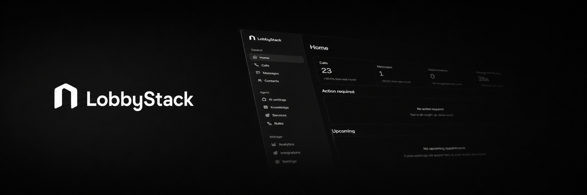

<p align="center">
  
</p>

<div align="center">

# LobbyStack

### The open-source AI receptionist for phone calls and appointments

LobbyStack is an open-source AI receptionist platform for small businesses. It answers phone calls, books appointments, handles appointment changes, and transfers calls to a person when needed.

It is built for clinics, salons, repair shops, local service companies, restaurants, and any business that loses revenue when nobody is available to answer the phone.

LobbyStack gives teams a modern AI front desk that can be hosted in the cloud or self-hosted on their own infrastructure.

[Website](https://lobbystack.com) &middot; [Try the app](https://app.lobbystack.com/signup) &middot; [Docs](https://docs.lobbystack.com) &middot; [Self-hosting](https://docs.lobbystack.com/self-hosting/overview) &middot; [GitHub](https://github.com/lobbystack/lobbystack)

[](./LICENSE) [](https://github.com/lobbystack/lobbystack) [](https://www.typescriptlang.org/) [](https://www.postgresql.org/) [](https://docs.lobbystack.com/self-hosting/overview)

[](https://railway.com/deploy/lobbystack)

</div>

## Why teams use LobbyStack

Most AI receptionist tools are closed, expensive, and difficult to adapt to real business workflows. LobbyStack is different.

- **Open source by default.** Inspect the code, self-host it, extend it, and keep control of your data.
- **Built for real phone calls.** Handle natural voice conversations, interruptions, live transfers, and messages for your team.
- **Calls and texts in one place.** Review calls, recordings, transcripts, and incoming texts from the same dashboard.
- **Scheduling built in.** Book, reschedule, and cancel appointments through Google Calendar.
- **Designed for small businesses.** Guided setup, transparent pricing, and no enterprise-only feature gatekeeping.
- **Human fallback.** Transfer calls or escalate messages when the AI should not handle something alone.

## Core features

### ☎️ AI phone receptionist

LobbyStack answers inbound calls with a natural voice agent trained on your business information. It can answer common questions, collect caller details, take messages, qualify requests, offer appointment slots, and transfer to a human when required.

### 💬 Text messages

LobbyStack saves texts sent to your business number and alerts your team. You read the thread and reply by hand from the dashboard. The AI doesn't answer texts; STOP and HELP get fixed replies.

### 📅 Appointment scheduling

LobbyStack connects to Google Calendar, checks availability, offers time slots, books appointments, and sends a confirmation text and one reminder text 24 hours before, if the caller agrees. Callers can also reschedule or cancel during a later call.

### 📚 Knowledge base

Upload business information, FAQs, services, pricing, policies, and internal notes. The AI uses this knowledge to answer accurately and consistently.

### 🧑‍💼 Human handoff

LobbyStack can transfer a live call, take a message, or notify the team by email or opt-in SMS when a person needs to respond.

### 📥 Shared inbox

Review calls, SMS threads, transcripts, recordings, appointments, and customer details from one dashboard.

### 🔌 Integrations

LobbyStack connects to Google Calendar to check availability and book appointments. It doesn't connect to other calendars or CRMs yet.

## Use cases

LobbyStack can be adapted for many local business workflows:

- Clinics and healthcare offices
- Salons, spas, and barbershops
- Auto repair shops
- Home service companies
- Restaurants
- Dental offices
- Law firms and professional services
- Property managers
- Any business that receives appointment, pricing, hours, or availability questions by phone

## Product areas

| Area | What it gives you |
| --- | --- |
| Voice reception | Inbound phone and browser calls answered by OpenAI GPT-Live, with Twilio phone numbers. |
| Business knowledge | Answers from structured business facts, text entries, documents, and imported website pages. |
| Booking | Service-aware scheduling with availability checks and calendar handoff. |
| Appointment changes | Safer cancellation and rescheduling flows with appointment lookup and verification. |
| Human handoff | Live transfer and follow-up tasks for calls that need staff attention. |
| Messages | Incoming texts with manual replies, connected to customer history. |
| Website widget | Embeddable chat, lead capture, and browser calls with per-site access controls. Restricted: new widget keys are off unless you set `WIDGET_KEY_ISSUANCE_ENABLED=true`. |
| Dashboard | Calls, messages, contacts, appointments, recordings, transcripts, follow-ups, and analytics together. |
| Usage and billing | Hosted plans, voice usage, alert SMS, transfer attempts, storage, and spending caps. |
| Bring your own API keys | Self-hosted deployments can use your own Twilio, OpenAI-compatible AI, calendar, email, analytics, and billing provider credentials. |

## Technology

| Layer | Main components |
| --- | --- |
| App | Next.js, React, Tailwind CSS, shadcn/ui |
| Backend | PostgreSQL, Drizzle ORM, Redis, BullMQ |
| Voice | OpenAI GPT-Live over SIP and WebRTC, Twilio Elastic SIP Trunking |
| Agent | Vercel AI SDK, `gpt-6-luna` or any OpenAI-compatible model |

## Hosted and open source

LobbyStack is open source with a hosted cloud service.

Use **LobbyStack Cloud** when you want the product managed for you. You still control the receptionist behavior, knowledge, services, rules, numbers, integrations, and team workflow from the app.

Self-host when your team wants to run the stack on your own infrastructure, bring your own API keys, and use your own PostgreSQL, Twilio, OpenAI-compatible AI, calendar, analytics, billing, and email provider accounts.

To self-host on Railway, deploy the [LobbyStack template](https://railway.com/deploy/lobbystack). Railway generates every secret and database password, and you enter an OpenAI API key and your Twilio credentials.

After deploying, set a few variables in Railway:

- **Email:** `SMTP_*` and `EMAIL_FROM` on the worker. Password resets, verification codes, and invites fail without them.
- **Phone calls:** an OpenAI webhook to `https://your_admin_domain/api/webhooks/openai/live`, its secret as `OPENAI_WEBHOOK_SECRET` on the admin, and your Twilio Elastic SIP trunk as `TWILIO_SIP_TRUNK_SID` on the worker. See [`docs/voice/runtime.md`](./docs/voice/runtime.md#set-up-the-phone-path).
- **Optional:** `FIRECRAWL_API_KEY` on the worker for website import, and `GOOGLE_CLIENT_ID` and `GOOGLE_CLIENT_SECRET` on the admin for Google Calendar.
- **Custom domain:** `APP_BASE_URL` on the admin. The other URL variables reference it.

The [self-hosting guide](https://docs.lobbystack.com/self-hosting/overview#after-deploying) has each step.

Full product control in the hosted app. Infrastructure ownership when you self-host. Same open-source core either way.

## Architecture for contributors

LobbyStack is a TypeScript monorepo with PostgreSQL as the durable source of truth. OpenAI hosts call audio; the admin app starts each call and the worker runs it.

```text
apps/
  admin/           Next.js dashboard and HTTP API
  worker/          asynchronous jobs, outbox dispatch, and live calls
packages/embed/    Vite bundle for the embeddable website widget loader
packages/          database, domain, agent core, jobs, providers, telemetry, and shared contracts
mintlify/          public documentation source
docs/              architecture notes, ADRs, provider docs, and validation notes
```

Read the [self-hosting overview](https://docs.lobbystack.com/self-hosting/overview) for the provider map and deployment expectations, or use the [Docker Compose guide](https://docs.lobbystack.com/self-hosting/docker-compose) for the official single-host baseline.

## Get started

### Use the hosted app

1. [Create a LobbyStack account](https://app.lobbystack.com/signup).
2. Verify your mobile number.
3. Import website knowledge, or skip and add knowledge manually later.
4. Choose a plan.
5. Claim a business number on Starter or Pro.
6. Configure AI settings, services, knowledge, and rules before sending live calls.

The full hosted walkthrough lives in the [setup guide](https://docs.lobbystack.com/quickstart).

### Run local development

```bash
cp .env.example .env
pnpm install
docker compose up -d postgres redis
pnpm db:migrate
pnpm dev
```

Local development stores recordings and uploads under `.lobbystack/storage`. Set `STORAGE_PROVIDER=s3` when you need to test an S3-compatible service.

Mock providers are part of the default development path, so contributors can exercise flows without live Twilio, AI, calendar, or email credentials. Provider setup notes live in the [docs](https://docs.lobbystack.com/self-hosting/providers).

### Deploy with Docker Compose

```bash
git clone https://github.com/lobbystack/lobbystack.git
cd lobbystack
pnpm install
cp .env.example .env
# Replace every placeholder before exposing the stack.
docker compose --env-file .env up -d --build
```

The stack uses stdout logs and health endpoints without running monitoring containers. Set `OTEL_EXPORTER_OTLP_ENDPOINT` and `OTEL_EXPORTER_OTLP_HEADERS` to send server telemetry to PostHog or another OTLP-compatible backend.

For prerequisites, local smoke vs production go-live, helper scripts, and troubleshooting, see the [Docker Compose self-hosting guide](https://docs.lobbystack.com/self-hosting/docker-compose).

## Contributing

Contributions are welcome. Start with [CONTRIBUTING.md](./CONTRIBUTING.md), keep durable business logic in the domain and database layers, and put the receptionist's tools in the agent core.

Before opening a PR, run:

```bash
pnpm typecheck
pnpm build
pnpm test
```

## License

LobbyStack is licensed under the [MIT License](./LICENSE).
