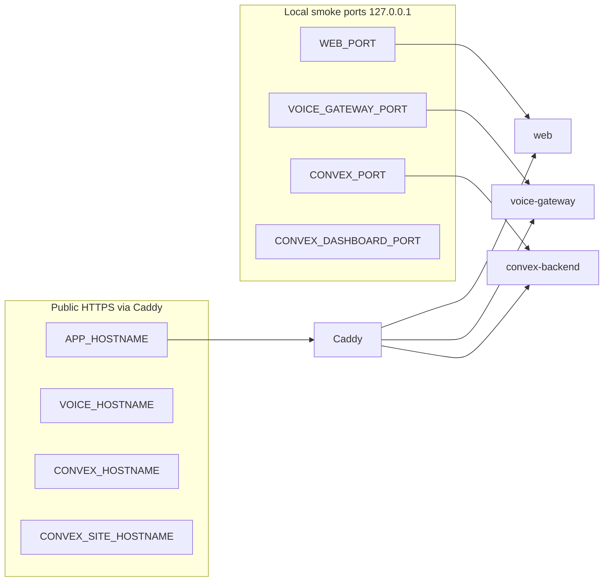

LobbyStack is open source and can be run with your own provider accounts. Self-hosting gives your team direct control over the app, external services, secrets, and provider usage.

## Deployment models

<Note>
  For live calls you still need Twilio, OpenAI, and correctly configured public URLs—even when everything runs on one machine.
</Note>

### Docker Compose (recommended single-host)

The official baseline runs on one host via [`docker-compose.self-hosted.yml`](https://github.com/lobbystack/lobbystack/blob/main/docker-compose.self-hosted.yml):

- Convex open-source backend and Convex dashboard
- LobbyStack web dashboard (built image)
- LobbyStack voice gateway (built image)
- Caddy for public HTTPS ingress

Follow the [Docker Compose deployment guide](/self-hosting/docker-compose) for installation, verification, and production configuration.

### Split deployment (advanced)

You can run components separately—for example, voice gateway on Fly.io and the web dashboard on static hosting. That path requires more manual wiring of URLs, secrets, and webhooks. The repository includes [`fly.voice-gateway.toml`](https://github.com/lobbystack/lobbystack/blob/main/fly.voice-gateway.toml) as one voice-gateway option; there is no separate Fly runbook in these docs yet.

Use split deployment when you need independent scaling or already operate multi-service infrastructure. For most teams starting self-hosting, Compose is simpler.

## Architecture (Compose baseline)

Public traffic hits Caddy on ports 80 and 443. Caddy routes four hostnames to internal services. For first-run validation, services also bind localhost ports so you can smoke-test without DNS.

## Components

| Component | Purpose |
| --- | --- |
| Convex backend | Stores business data and runs backend functions, HTTP endpoints, auth, billing logic, calendar sync, SMS, and knowledge workflows. In Compose, uses the open-source image `ghcr.io/get-convex/convex-backend`. |
| Convex dashboard | Operator UI to inspect the self-hosted deployment, indexes, and data. Bound to localhost by default. |
| Voice gateway | Node.js service that handles Twilio Voice, Twilio Media Streams, OpenAI Realtime, transfers, and recording upload. |
| Web dashboard | React/Vite app operators use to configure the receptionist and review activity. |
| Caddy | Terminates HTTPS and reverse-proxies public hostnames to web, voice, and Convex. Config is baked into the `caddy` Compose image at build time. |

## Convex self-hosted vs Convex Cloud dev

| | **Compose self-hosting** | **Local contributor dev (`pnpm convex dev`)** |
| --- | --- | --- |
| Backend | Open-source Convex backend in Docker | Convex Cloud deployment |
| Config | `.env.self-hosted` + `CONVEX_SELF_HOSTED_*` | `.env.local` with `CONVEX_DEPLOYMENT` |
| Purpose | Production-like single-host operation | Day-to-day app development |

Do not point production self-hosting at Convex Cloud dev deployments. The helper scripts `pnpm self-hosted:convex:env` and `pnpm self-hosted:convex:deploy` target your self-hosted URL and temporarily isolate `.env.local` so cloud dev credentials do not conflict.

## Required providers for live voice

- **Convex** for backend and storage (self-hosted backend in Compose, or your own Convex deployment).
- **Twilio** for phone numbers, voice calls, SMS, and phone verification.
- **OpenAI** for Realtime voice conversations.
- **Public HTTPS URLs** for the web app, voice gateway, Convex client URL, and Convex HTTP actions site (Caddy provides these in Compose).

## Optional providers

- **Google Calendar** for calendar availability and booking sync.
- **Firecrawl** for website knowledge import.
- **Google Gemini** for knowledge embeddings and non-realtime text generation.
- **Resend** for password reset and email-change emails.
- **PostHog** for analytics and telemetry.

## What your team manages

When self-hosting, your team manages:

- Twilio account setup, phone numbers, webhooks, A2P/10DLC compliance, and SMS costs.
- OpenAI usage costs.
- Convex deployment ownership, admin keys, and persistence (Compose volume `convex_data` by default).
- Host uptime, Docker updates, and public networking (firewall, DNS, TLS).
- Secret management and syncing provider secrets into the Convex deployment via `pnpm self-hosted:convex:env`.
- Product, privacy, retention, and compliance policies for your deployment.

<Note>
  HA Postgres, S3/object storage, backups, and multi-node hardening are out of scope for the Compose baseline. Plan those separately if you need enterprise-grade infrastructure.
</Note>

## Next steps

<CardGroup cols={2}>
  <Card title="Docker Compose" icon="server" href="/self-hosting/docker-compose">
    Run the single-host Compose baseline with Convex, the dashboard, web app, voice gateway, and Caddy.
  </Card>
  <Card title="Environment variables" icon="sliders" href="/self-hosting/environment-variables">
    Review the main runtime and provider variables used by the app.
  </Card>
  <Card title="Third-party providers" icon="plug" href="/self-hosting/providers">
    See what each external provider does in LobbyStack.
  </Card>
</CardGroup>
